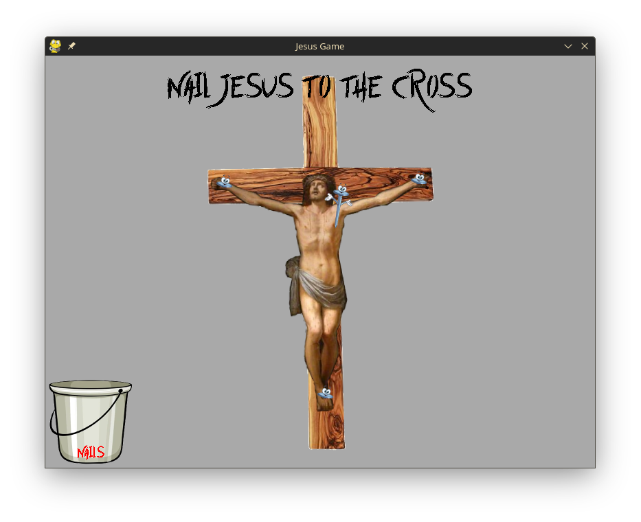

# Jesus Game

[](https://github.com/Gandalf138/JesusGame/actions/workflows/build.yml)

<p align="center">
    
</p>

An educational `pygame` challenge!

## Playing

### Prebuilt Executable

Download an appropriate build from the [Release](https://github.com/Gandalf138/JesusGame/releases/latest) section, or grab a build artifact from the most recent commit in [Actions -> build.yml -> **_\<most recent commit\>_**](https://github.com/Gandalf138/JesusGame/actions/workflows/build.yml)

### Using a Start Script

`macOS`, `Linux`, `BSD`, `IRIX`, and other `pygame` supported Unix-likes:

- Run `play.sh`

`Windows`:

- Run `windows_play.ps1`

### Manually

`macOS`, `Linux`, and other `pygame` supported Unix-likes:

```sh
python3 -m venv venv
source ./venv/bin/activate
pip install --upgrade pip
pip install -r requirements.txt
python3 main.py
```

`Windows`:

```powershell
py -m venv venv
./venv/Scripts/Activate.ps1
pip install --upgrade pip
pip install -r requirements.txt
py main.py
```

## Building

I recommend using a virtual environment like the steps above.

Install pyinstaller:

```sh
pip install pyinstaller
```

Then build using a command like this:

```sh
pyinstaller --onefile --add-data 'data:data' main.py
```

The `data/` directory must be added, the `--onefile` flag is optional.

<p align="center">
    </img>
</p>
